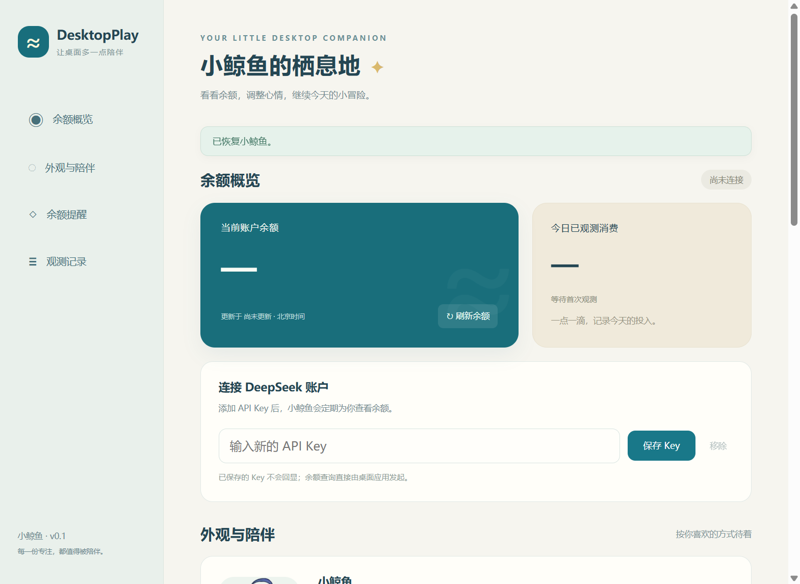
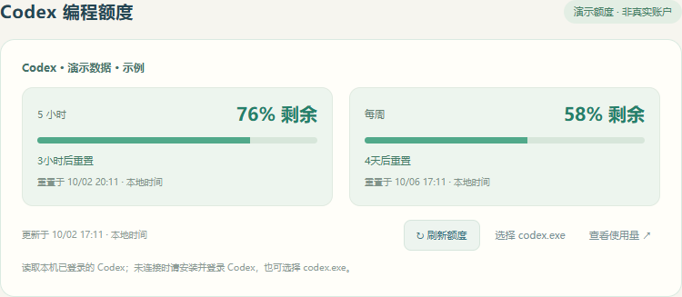

# DesktopPlay

DesktopPlay 是 Windows 桌面上的双角色桌宠：小鲸鱼查看 DeepSeek 余额，GPT 小伙伴查看 Codex 编程额度。面向 Windows 10/11 x64，提供 NSIS 安装版和 portable 免安装版。桌宠本身不需要 Node.js 或 DeepSeek Harness（DSH）；实时 Codex 额度需要本机已有原生 Codex 程序，并已使用 ChatGPT 账户登录。

## 桌宠与功能

- 漫画对白气泡、按压弹性动画和音效；尖尾跟随角色朝向。
- 拖动、四边吸附、贴左翻转、透明区域穿透、置顶与托盘管理。
- 导入 PNG、WebP、GIF，调整大小、短句和音量；小屏幕自动限制实际尺寸。
- DeepSeek 余额自动刷新、今日已观测消费、余额增加记录、低余额和每日预算提醒。
- 本地加密保存 API Key，开机启动默认关闭。
- 设置或右键菜单切换小鲸鱼 / GPT 小伙伴，记住所选角色；两种角色分别保存自定义图片。
- GPT 小伙伴显示 Codex 剩余百分比、额度窗口、重置时间及倒计时，支持自动和手动刷新。







## 获取与运行

从 [GitHub Releases](https://github.com/Forest-Wood/DesktopPlay/releases) 下载：

- `DesktopPlay-<版本>-Setup-x64.exe`：交互式安装，可选择安装目录并创建桌面快捷方式。
- `DesktopPlay-<版本>-Portable-x64.exe`：单文件免安装版，直接运行。

两种版本都把应用设置、加密保存的 API Key、账本和用户导入的图片放在 `%APPDATA%\DesktopPlay`。Portable 版也使用这个目录；删除 portable exe 不会自动删除这些数据。卸载安装版时默认保留数据。

首次运行后，在应用设置中输入 DeepSeek API Key。密钥由 Windows 加密后保存在当前 Windows 用户的数据目录中；不要把密钥提交到仓库、截图或问题报告里。应用通过 DeepSeek API 查询余额。余额数值和用量记录是应用观测值，不是 DeepSeek 官方账单；同一账户通过其他 API Key 或客户端产生的余额变化也可能反映在这些观测值中。

今日账本以 UTC+8 每天首次成功取得的余额快照建立当日基线；该跨日首个快照不会将它与前一天的余额差计入当天。当天后续成功快照按相邻快照计算：余额下降累计为已用量，余额增加单独累计，不抵扣已用量。因此无法从两个快照还原其间同时发生的消费和充值。网络请求失败时会保留最近一次成功取得的余额，并显示错误状态，不会把失败当成余额归零。

## GPT 小伙伴与 Codex 额度

1. 在设置中选择 **GPT 小伙伴**，或右键桌宠 → **切换桌宠**。
2. 在官方 Codex CLI 或 VS Code 扩展中使用 ChatGPT 账户登录。DesktopPlay 自动寻找本机 `codex.exe`；未找到时可在设置中选择已安装的原生 `codex.exe`。
3. 点击桌宠或设置中的刷新按钮查看额度。GPT 角色启用或设置窗口打开期间，每 60 秒自动刷新。

额度来自官方 Codex App Server 的 [`account/rateLimits/read`](https://learn.chatgpt.com/docs/app-server#6-rate-limits-chatgpt) 只读接口。程序显示服务返回的实际窗口长度，例如 5 小时、每周；不会将所有账户硬编码为同一种额度。剩余百分比由 `100 - usedPercent` 计算，重置时间来自服务端 Unix 时间戳，界面按电脑本地时区显示。它不是 ChatGPT 网页对话额度，也不是 OpenAI API 余额。

离线或查询失败时保留最近成功数据并标记错误和更新时间。倒计时归零只表示到达服务上次报告的时间，需要重新查询才能确认恢复；未知窗口或重置时间显示“未知”，不会虚构余额或恢复时间。没有登录或没有安装 Codex 时，两个桌宠和 DeepSeek 功能仍可使用。

DesktopPlay 通过 Codex 原生程序读取额度，不读取或复制 `auth.json`，不要求在桌宠中粘贴 ChatGPT 登录令牌，不启动对话或消耗推理额度。登录凭据仍由官方 Codex 管理。若额度失效，请在 Codex 中重新登录后刷新。

GPT 小伙伴为根据用户提供参考图生成的二创形象，不是 OpenAI 官方吉祥物。素材说明与生成提示词见 [GPT 素材记录](docs/gpt-art-prompt.md)。

## 从源码运行

需要 Windows 10/11 x64、Node.js 24 和 npm。克隆仓库后在项目目录执行：

```powershell
npm ci
npm run dev
```

开发与打包命令：

```powershell
npm test
npm run build
npm run test:smoke
npm run dist
```

`npm run dev` 启动 Vite 和 Electron 开发版；`npm test` 运行单元测试；`npm run build` 先做 TypeScript 类型检查，再构建界面和 Electron 主进程；`npm run test:smoke` 运行 Playwright Electron 冒烟流程，不需要额外安装浏览器；`npm run dist` 在 Windows x64 上生成 NSIS 和 portable 安装包到 `release/`。发布包不包含账本、API Key 或用户导入图片。

## CI 与发布

推送到 `main` 或向 `main` 提交 Pull Request 时，GitHub Actions 在 Windows runner 和 Node.js 24 上安装依赖、执行类型检查、单元测试、构建和 Electron 冒烟测试。推送 `v*` 标签时，发布工作流要求标签版本与 `package.json` 版本一致，重新运行测试并构建 Windows x64 安装包，计算 SHA-256 校验和，然后创建 GitHub Release 并附上安装版、portable 版和校验文件。普通分支提交不会创建 Release。

## 常见问题

**启动时提示 Windows 已保护你的电脑或未知发布者？** 首版安装包未进行代码签名，Windows SmartScreen 可能显示警告。请只从本仓库的 Releases 下载，并在运行前核对发布页提供的 SHA-256 校验和。

**Portable 版是否把数据保存在 exe 旁边？** 否。为了让两个版本行为一致，portable 版也使用 `%APPDATA%\DesktopPlay`；将 exe 移到其他位置不会移动设置、密钥或账本。

**为什么今日已用量和官方账单不同？** 这是根据应用成功观察到的相邻余额快照计算的估算值：余额下降累计为已用量，余额增加单独累计。UTC+8 跨日后的首个快照建立新基线；首次快照前的变化以及同一观测间隔内同时发生的消费和充值无法准确拆分。

**余额没有更新怎么办？** 检查网络和 API Key，稍后重试。请求失败时应用保留上一次成功的余额，直到后续请求成功。

**卸载后数据还在吗？** 安装版卸载默认保留 `%APPDATA%\DesktopPlay`。如果确实要清除本机数据，请先退出应用，再由当前 Windows 用户自行删除该目录。

## 许可与素材

本仓库原创代码由 Forest-Wood 按 MIT License 发布，见 [LICENSE](LICENSE)。部分实现参考 MeteorNOX 的 [DeepSeek-Balance-Whale-Widget](https://github.com/MeteorNOX/DeepSeek-Balance-Whale-Widget)，保留其 MIT 许可证全文和来源说明，见 [THIRD_PARTY_NOTICES.md](THIRD_PARTY_NOTICES.md)。

鲸鱼图片与音效来自该上游仓库 commit [`49d688d46673fbf4221b458afc943276c68a0839`](https://github.com/MeteorNOX/DeepSeek-Balance-Whale-Widget/tree/49d688d46673fbf4221b458afc943276c68a0839) 的 `assets/DSniang1.png`、`assets/Ya1.mp3`、`assets/Ya2.mp3`，在本项目中分别重命名为 `whale.png`、`press.mp3`、`release.mp3`。它们不属于本仓库代码的 MIT 授权范围，也不宣称为 MIT 素材。仓库维护者确认已取得独立分发这些素材的授权；此确认由维护者提供，仓库没有随附另行制作的书面授权文件。来源记录见该版本的上游 [PROVENANCE.md](https://github.com/MeteorNOX/DeepSeek-Balance-Whale-Widget/blob/49d688d46673fbf4221b458afc943276c68a0839/PROVENANCE.md)。
