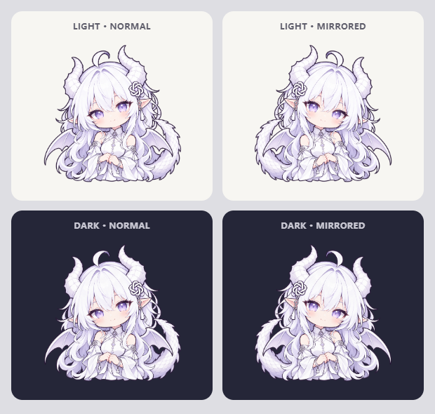

# DesktopPlay v0.3.0

GPT 白龙加入内置造型，漫画气泡支持分页、挽留互动和跟随朝向显示。

## 更新内容

- GPT 账户角色增加原版与白龙两种内置造型，可独立切换并保留已有自定义图片；桌宠造型与 DeepSeek / GPT 账户角色分开管理，共用同一份 Codex 额度数据。
- 点击桌宠可循环浏览用量、用量总结和设置中的陪伴短句，每页显示一条短句。翻页不会发起额度请求；额度仍按原有定时刷新，气泡页脚提供手动刷新按钮。
- “换角色”先显示当前角色的挽留语句，由用户确认切换或选择再陪一会儿；“换造型”即时生效。设置和托盘菜单中的角色选择保持直接切换。
- 气泡使用漫画外框和尾巴，随人物面朝方向显示，并在顶部空间不足时避让。人物靠近工作区顶部时上下倒挂；文字、按钮与页码保持正向。人物左右自动朝向屏幕中央。
- 提升额度数字和陪伴内容的可读性：额度数字 34px，短句和总结 24px。
- 大号桌宠在小屏幕及纵向显示器上自动限制实际缩放，保证朝向和气泡上下切换时人物位置连续。

## 素材

白龙是根据用户提供的参考图生成的非官方二创造型，不代表 OpenAI 官方形象或认可。生成提示词和制作记录见 [GPT 白龙素材记录](../gpt-dragon-v2-art-prompt.md)；授权及权利边界见 [第三方代码与素材声明](../../THIRD_PARTY_NOTICES.md)。

## Windows 下载包

Windows x64 文件：

- `DesktopPlay-0.3.0-Setup-x64.exe`：NSIS 安装版。
- `DesktopPlay-0.3.0-Portable-x64.exe`：单文件 portable 免安装版。

下载文件和 SHA-256 校验值见本版本 GitHub Release 附件。

## 本地验证

- 73 项单元测试、3 项 Electron 交互测试、TypeScript 检查及生产构建通过。
- 安装版和免安装版在不包含 Node.js 的 PATH 环境中启动，造型切换、分页及挽留交互通过；这项检查不是全新 Windows 虚拟机验收。
- 使用本机已登录 Codex 验证真实额度读取成功；公开截图均使用明确标记的演示数据。
- 安装和卸载程序均返回成功，卸载移除程序且保留用户数据。
- 发行包检查仅包含应用代码、内置素材及许可证，不包含密钥、账本或私人图片。
- 9 张真实界面截图覆盖用量、总结、长短句、挽留、镜像和倒挂；100% / 99.9% 在 34px 字号下并列显示不溢出，页脚完整可见。
