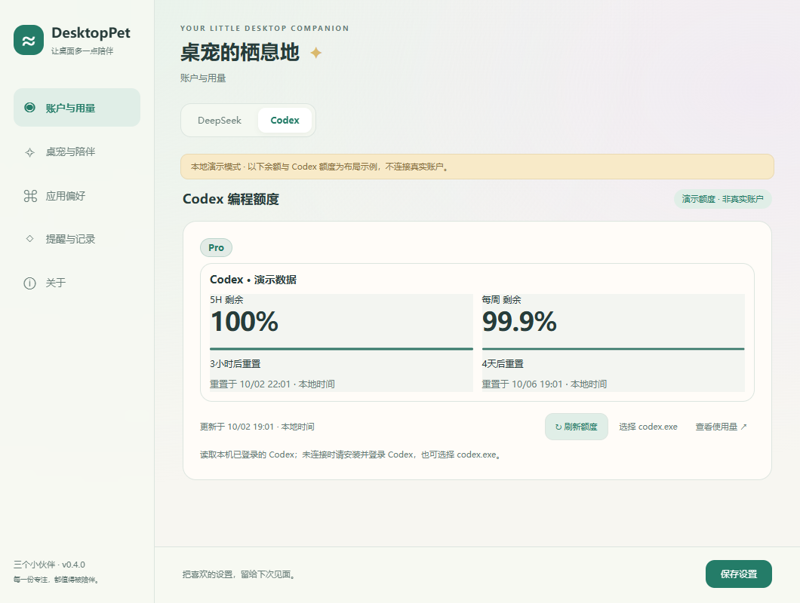
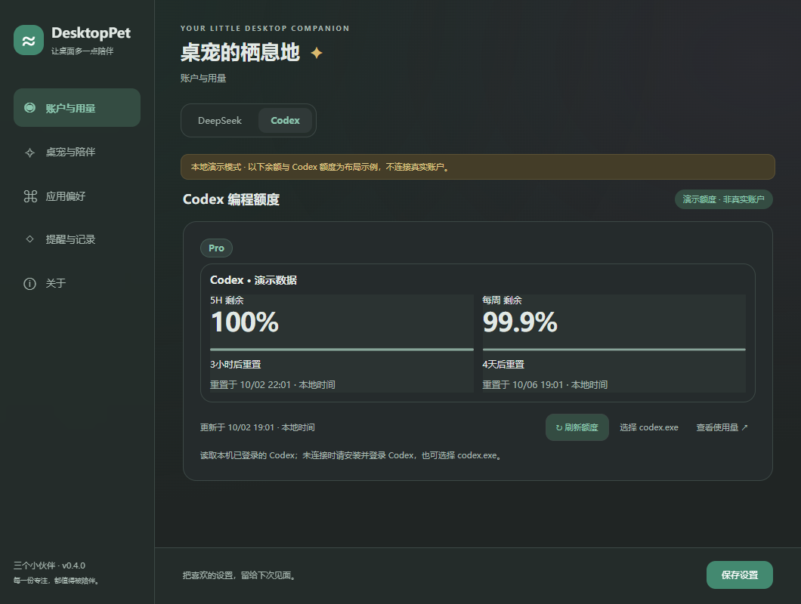

# DesktopPet v0.4.0

DesktopPlay 正式更名为 **DesktopPet**。GitHub 仓库、安装身份和 `%APPDATA%\DesktopPlay` 数据目录保持兼容。

## 新增与修复

- 重做设置导航：左侧分类与页内标签、跨页草稿、固定保存栏；新增随 Windows 自动切换的浅深色主题、弥散渐变与圆润控件。
- Codex 增加 Plus／Pro 套餐识别，按实际窗口时长排列 5H／每周剩余额度和重置倒计时，标签更紧凑；未提供的窗口明确提示，不估算额度。
- 小鲸鱼、GPT 原版、白龙拥有三套独立短句，旧短句完整保留。
- 修复左下角按压时左右翻转；修正白龙透明底边，贴底／倒挂贴顶按可见轮廓对齐。
- 安装升级更新 DesktopPet 名称与快捷方式，自启保留兼容身份并更新 EXE 路径。

## 下载与使用

- `DesktopPet-0.4.0-Setup-x64.exe`：Windows 10/11 x64 安装版，支持卸载。
- `DesktopPet-0.4.0-Portable-x64.exe`：免安装版，直接运行。
- `SHA256SUMS.txt`：发布附件校验和。

应用无需 Node.js；Codex 实时额度仍需要本机已安装并登录的原生 Codex。安装包未签名。两种版本共用原用户数据目录，卸载保留用户数据。

## 验证

- 类型检查、构建、91 项单元测试和 4 项 Electron 交互测试通过。
- 覆盖四种镜像下真实按住／松开、三套短句、Plus／Pro／未知套餐、5H 缺失和窗口顺序、草稿保存、11 个设置子页及系统主题切换。
- 几何测试覆盖多种缩放、负坐标显示器与四角贴边，可见轮廓取整误差不超过 1 DIP；未进行实体多屏热拔插测试。
- 本机 Windows 完成 v0.3.0 安装升级、快捷方式替换、自启路径迁移及卸载；卸载清理对应自启项，保留用户数据。
- 安装版与免安装版在仅含 Windows System32 的 PATH 下启动成功，真实 Codex 查询与套餐识别通过。这是本机验证，不等同于全新 Windows 10/11 虚拟机测试。
- 发行包清单已检查，不含用户密钥、账本和私人图片。

## 界面预览

