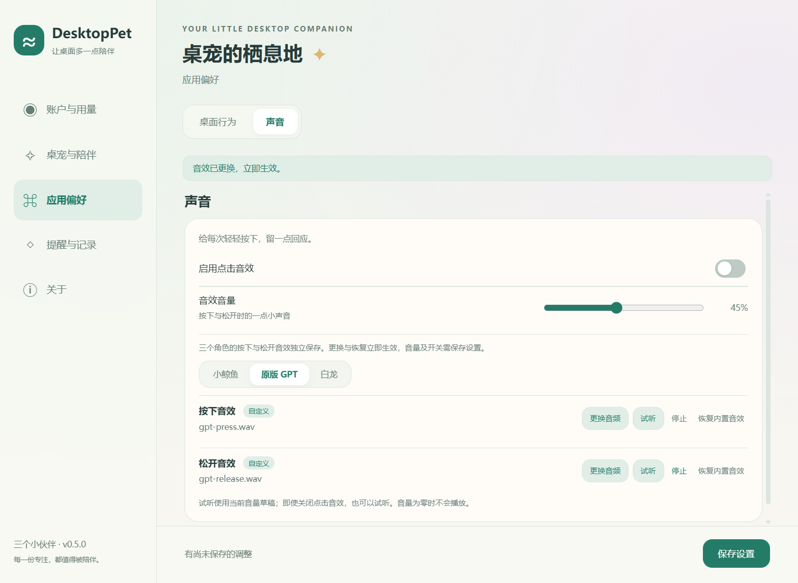
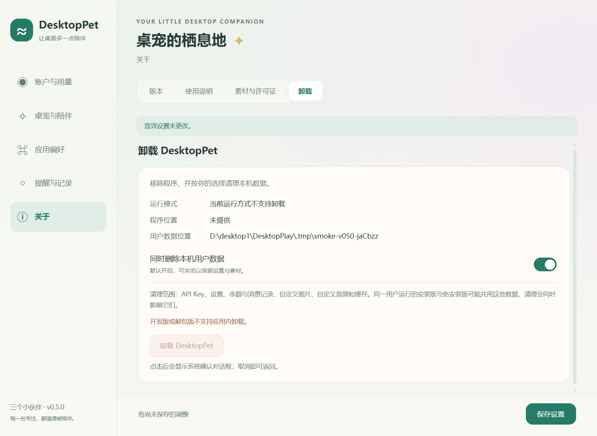
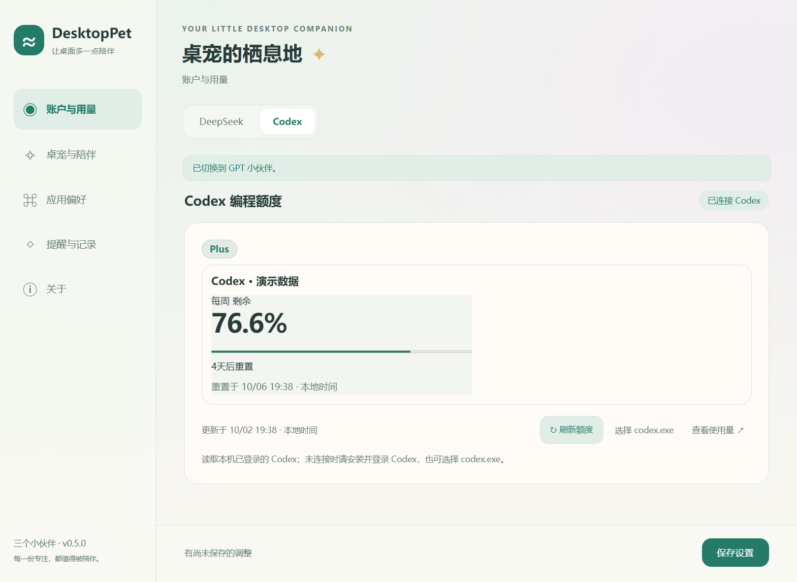
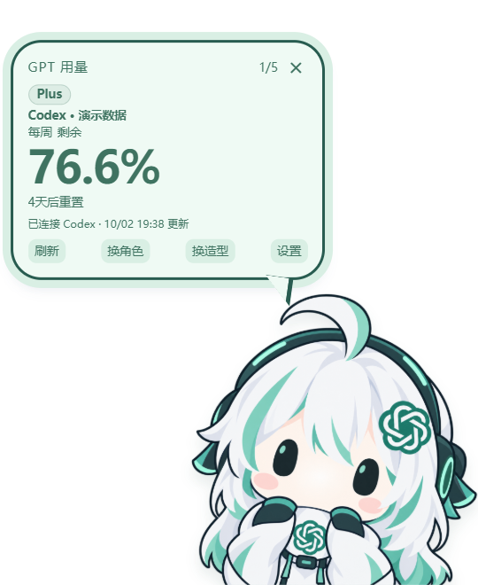

# DesktopPet v0.5.0

新增自定义点击音效和应用内卸载，统一 GPT 主额度为每周在左、实际返回的 5H 在右。继续沿用 `Forest-Wood/DesktopPlay` 仓库、安装身份和 `%APPDATA%\DesktopPlay` 数据目录。

## 自定义点击音效

- “应用偏好 → 声音”分别设置小鲸鱼、原版 GPT、白龙的按下／松开音效，共六个独立槽位；自定义 GPT 图片沿用原版 GPT。旧版本升级后各槽位默认使用现有内置音效。
- 支持 MP3、WAV、OGG，单文件不超过 5 MiB。主进程验证实际音频格式并复制文件，原子保存；取消选择或校验失败保留原音效，删除来源文件不影响已导入音效。
- 更换及恢复内置音效立即生效；总音效开关、音量仍需保存设置。试听使用当前音量草稿，关闭总开关时也可试听；切页、切换人设、新试听及修改音效停止旧音频。
- 异步加载不能将旧人设音效应用到新角色。音频丢失、损坏或播放失败时回退内置音效并提示。应用状态仅传递名称、自定义状态、版本号和提示，音频内容按需读取。

## 应用内卸载与数据

- “关于 → 卸载与数据”显示版本类型和待删除程序位置；默认勾选“同时删除本地数据”，用户可以取消。最终确认默认聚焦取消。
- 本地数据包含密钥、设置、账本、导入图片、音效和缓存。安装版、免安装版及其他版本共享 `%APPDATA%\DesktopPlay`，清理会影响共享这些数据的版本。
- 卸载仅针对当前安装或当前运行的免安装 EXE；其他下载副本、源码仓库和官方 Codex 登录数据不在删除范围。源码开发版不提供应用内卸载。
- 请求确认后停止刷新，阻止重复卸载和新的写操作，等待已经开始的账本、素材、设置和窗口位置写入，然后正常退出。启动辅助程序失败时应用保持运行。
- 安装版由独立临时辅助程序启动当前安装目录的 NSIS 卸载器，收到成功回执后才按选择清理数据；进程检查限定当前安装目录，升级不触发清理。从 Windows 设置或独立 NSIS 卸载器卸载时默认保留数据。
- 免安装版核对当前启动器与 EXE，等待退出后再次验证文件身份，只删除该 EXE，不递归删除所在文件夹。文件替换、占用超时或权限不足时保留文件并报告失败。
- 数据清理再次验证 `%APPDATA%\DesktopPlay`，不跟随目录链接；卸载完成或失败由系统对话框反馈。

## GPT 额度展示

- Pro、Plus 和其他套餐共用规则：每周固定在左，仅当接口实际返回 300 分钟窗口时在右侧显示 5H。
- 缺少 5H 时隐藏右侧项目，不显示“未提供”，每周保持左侧；缺少每周但有其他有效额度时，左侧保留“未提供”。没有有效额度时继续显示未知或连接状态。
- 依据窗口时长识别，不依赖 primary／secondary 顺序。其他时长和额外分组继续显示在后续区域。
- 气泡与设置页保留 34px 百分比、紧凑标签和重置倒计时；刷新失败保留最近成功数据及已有窗口。

## 下载与升级

- `DesktopPet-0.5.0-Setup-x64.exe`：Windows 10/11 x64 安装版。
- `DesktopPet-0.5.0-Portable-x64.exe`：单文件免安装版。
- `SHA256SUMS.txt`：两个 EXE 的 SHA-256 校验和。

应用本身无需 Node.js；实时 Codex 额度仍需本机已有并登录的原生 Codex。覆盖升级继续使用既有数据。安装包仍未签名，发布者可能显示为未知；请从本仓库 Releases 下载并核对校验和。

发布完成以源码推送、GitHub Actions 成功，以及上述三个附件可下载为准。

## 验证范围与限制

音效单元验证覆盖六槽独立、升级默认值、重启记忆、源文件删除、恢复默认、无效与超限文件、损坏回退和原子保存恢复；服务验证覆盖暂停刷新、迟到余额不记账、等待已有设置和素材写入，以及恢复刷新。

安装版已在独立安装目录完成 v0.4.0 → v0.5.0 覆盖升级，验证设置、角色、自定义素材状态和密钥配置继续保留；通过真实应用内请求卸载并保留数据，辅助程序收到 NSIS 成功回执，程序文件被移除，共享数据仍在。免安装版已验证启动和启动器身份识别，最终卸载确认阶段因桌面自动化被 Esc 中止而未完成，不计作完整卸载验收。

生产清理函数在工作区临时 fixture 目录验证了普通删除、相邻文件保留、替换文件 hash 拒绝，以及 junction 祖先／后代拒绝与目标保留；模拟辅助程序测试覆盖准备、提交和取消握手。本机因权限未执行符号链接用例。文件占用超时、权限不足和真实数据完整清理尚未完成端到端验证。本机没有可用的管理员权限、隔离 Windows 账户或虚拟机，因此没有在真实 `%APPDATA%\DesktopPlay` 执行完整清理；fixture 检查不能替代隔离账户或虚拟机验收。

类型检查、117 项单元测试、5 项 Electron 交互测试和 Windows x64 打包通过。测试用 GUI 进程的清理不计入应用内卸载成功；安装版结果以上述成功回执和文件检查为依据。所有交互测试使用独立测试配置，预览采用演示额度。

## 界面预览

